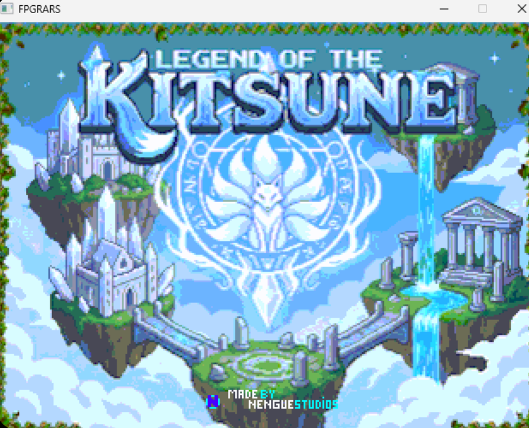
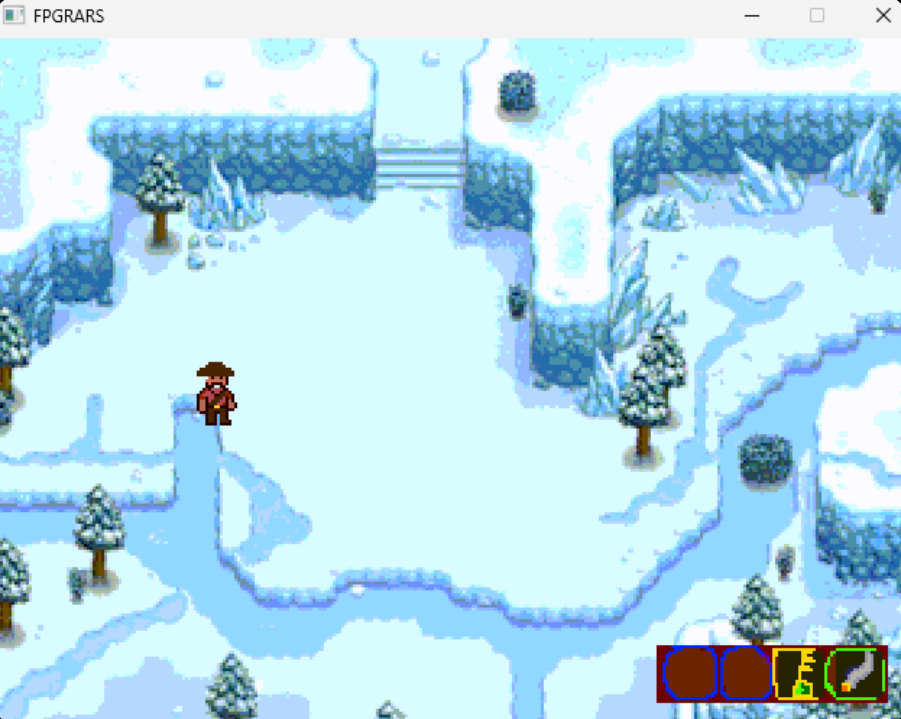
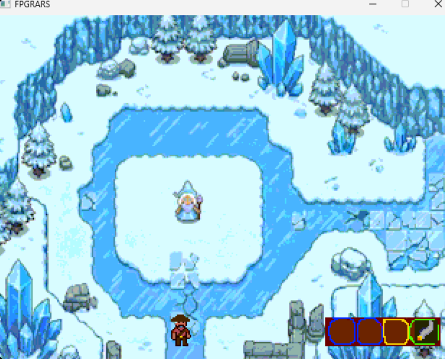
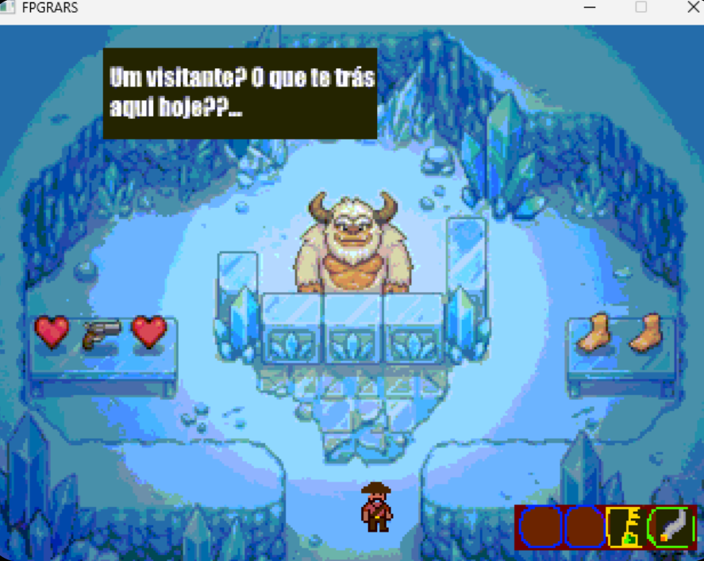
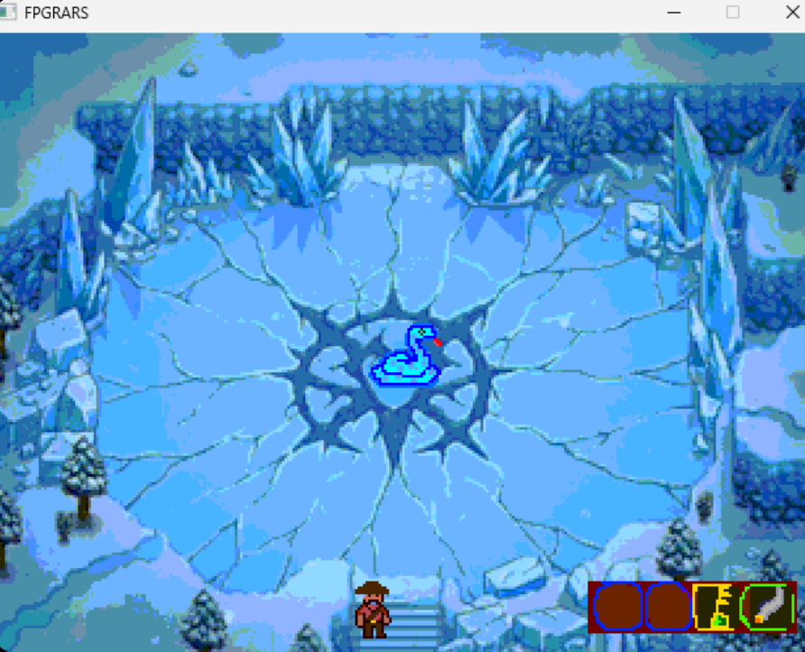

# 🦊 Legend of the Kitsune | RISC-V Assembly

RPG de aventura desenvolvido em **Assembly RISC-V (RV32I)** para a disciplina de Organização de Computadores na **Universidade de Brasília (UnB)**.

  

## 🎮 Sobre o Projeto
O **Legend of the Kitsune** simula uma engine de jogo clássica rodando diretamente sobre o hardware via simulador **FPGRARS**. O projeto explora a manipulação de memória e sistemas de entrada/saída de baixo nível.

## 🖼️ Galeria / Gallery

|  |  |
| :---: | :---: |
| 🗺️ **Exploração e Mapas** | 💬 **Sistema de Diálogos e NPCs** |
|  |  |
| 🛒 **Interação com Cenário** | ⚔️ **Combate e Boss Fight** |

## ✨ Destaques Técnicos
* **Engine Gráfica:** Renderização via Bitmap Display (320x240) com suporte a transparência.
* **Gestão de Memória:** Uso direto do Heap (`0xFF000000`) para renderização de frames.
* **Lógica de Colisão:** Implementação de detecção de barreiras baseada em tiles.
* **Áudio MIDI:** Trilha sonora integrada via syscalls de tempo real.
* 
 ## 🎮 Controles / Controls

| Ação / Action | Tecla / Key |
| :--- | :---: |
| Mover para cima / Move up | **W** |
| Mover para esquerda / Move left | **A** |
| Mover para baixo / Move down | **S** |
| Mover para direita / Move right | **D** |
| Atacar / Interagir (Attack / Interact) | **K** |

---

## 👾 Bestiário / Bestiary

| Inimigo / Enemy | Comportamento / Behavior 
| :--- | :--- | :---: |
| 🐍 **Cobra** | Ataque à distância e movimento circular 
| 👤 **Jagunço** | Movimentação básica e patrulha 
| 👹 **Yeti (Loja)** | NPC Interativo / Boss Estático 
| 🧊 **Rainha de Gelo** | NPC Interativo / Estático
---

## 👥 Equipe de Desenvolvimento / Development Team

| Desenvolvedor / Developer | Papel / Role |
| :--- | :--- |
| **Geovanne Junio** |  |

---

## 📜 Licença / License

Este projeto está licenciado sob a **Licença MIT** - veja o arquivo [LICENSE](LICENSE) para mais detalhes.

---

   Se você gostou deste projeto arretado, considere dar uma estrela! / If you enjoyed this project, consider giving it a star!
   
  Feito com muito energetico e carinho | Made with lots of energy drink and fondness

## 📂 Estrutura do Projeto
* **`/src`**: Código-fonte (`main.s`) e lógica de áudio.
* **`/assets`**: Arquivos `.data` com sprites, menus e mapas.
* **`/Screenshots`**: Registros visuais das funcionalidades.
* **`/tools`**: Scripts Python para conversão de imagens.
* **`/docs`**: Documentação e requisitos da disciplina.

## 🚀 Como Executar
1. Abra o **FPGRARS**.
2. Em `Tools > Bitmap Display`, configure: **320x240**, Base Address: **0xFF000000**.
3. Monte e execute o arquivo `src/main.s`.

---

👨‍💻 [Geovanne Junio](https://www.linkedin.com/in/geovanne-junio-18849b1b2/) - Ciência da Computação, UnB.

